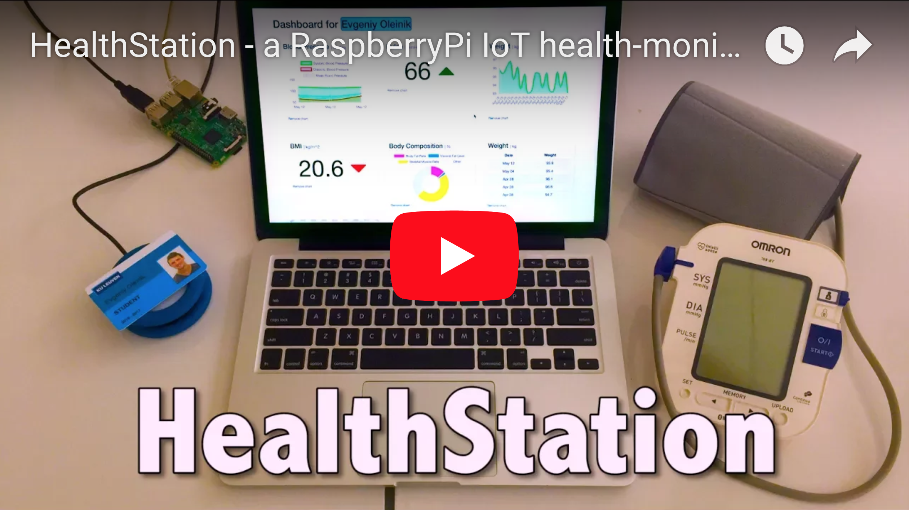

# HealthStation dashboard
A serverless solution for monitoring health.

- Raspberry Pi records data from connected **Bluetooth** sensors
- Patients are identified using an **RFID** scanner
- Measurements are stored in a no-SQL real-time **Firebase** database
- Health stats are displayed on a configurable dashboard, written in **Angular**

(click to see demo on YouTube)

To run the project, please install [Angular CLI](https://github.com/angular/angular-cli) using `npm install -g @angular/cli`

## Development server
Run `ng serve` for a dev server. Navigate to `http://localhost:4200/`. The app will automatically reload if you change any of the source files.

## Further help
To get more help on the Angular CLI use `ng help` or go check out the [Angular CLI README](https://github.com/angular/angular-cli/blob/master/README.md).
